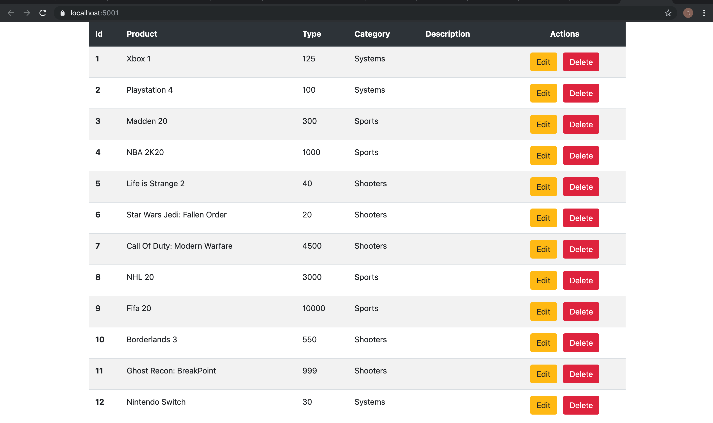
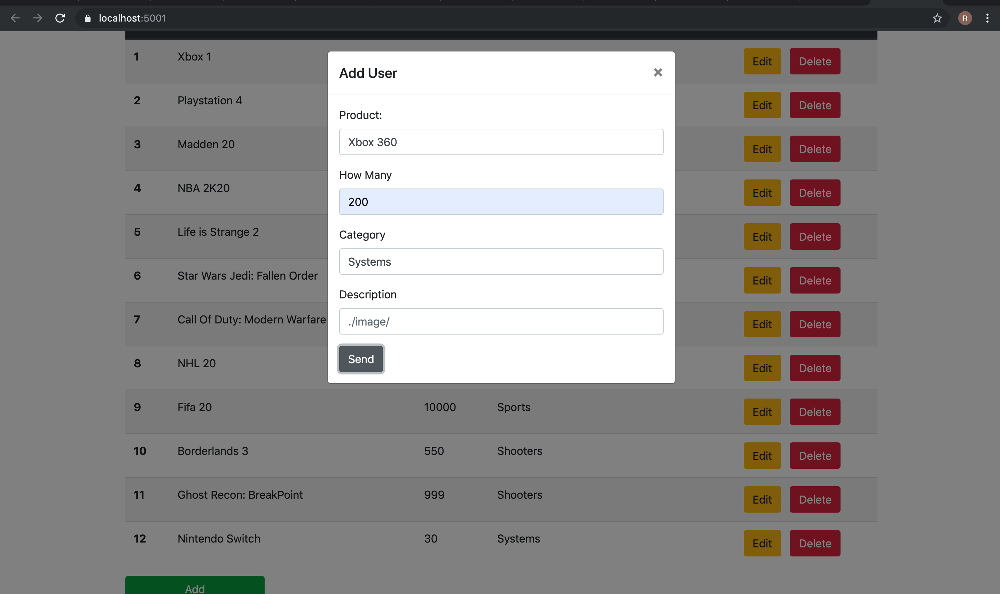
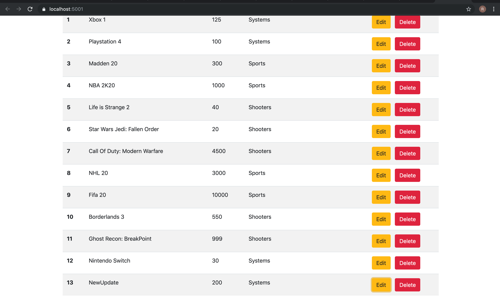
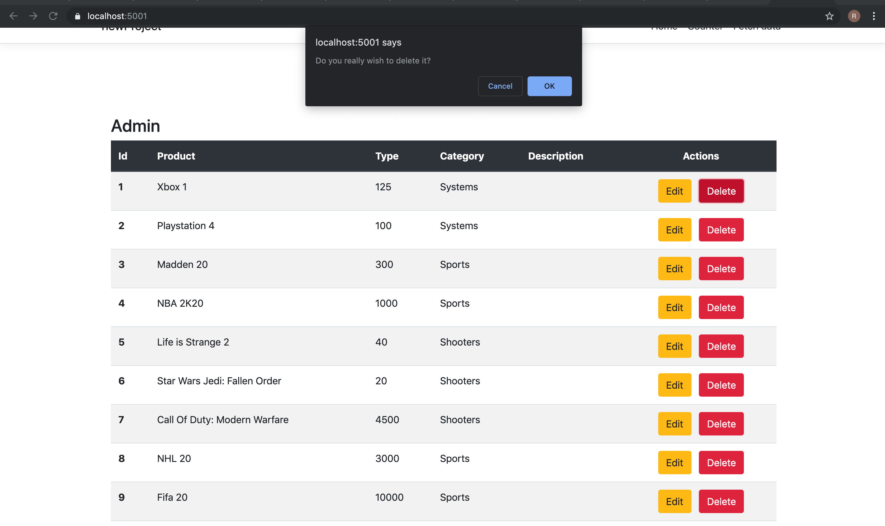

# C# Admin Page


C# Admin Page task was to build a dotnet server for my Ecommerce-Page [https://github.com/rtjohnson0/Ecommerce-Project] while connecting it to our own MySql Database. This task was built and launched by Reginald Johnson

##  Read


-   Showcasing all the products in my MySql databse.


##  Add

-   Filling the information for a new product
-   Letting the admin be able to access their products and adjust when something new arrives!


-   Showing the addition to the new products table

## Edit



-   Editing the new addition

## Delete


-   Asking if the admin wants to delete the product
-   This prevents accidentally deleting a product


-   Showing the new updated products after the delete!


# Prerequisites & Installation!
```
   1.   git clone the repository
   2.   open in code editor
   3.     open terminal
   4.     npm install
   5.    create .env with your own local mongoDB
   6.   npm run start
  ```


##  Languages & Tools
  - __React__ is used for the UI
  - __MySql__ is used for our database to record exercises and personal user information
  - __C#__  evented I/O for the backend


## Authors

Author(s) contributed to all back-end and front-end code to this project.All author(s) contributed to the repo.

| Name | Github Links |
| ------ | ------ |
| Reginald Johnson | [https://github.com/rtjohnson0] |


License
----

MIT [https://github.com/rtjohnson0/Admin-Page/blob/master/LICENSE]


   
